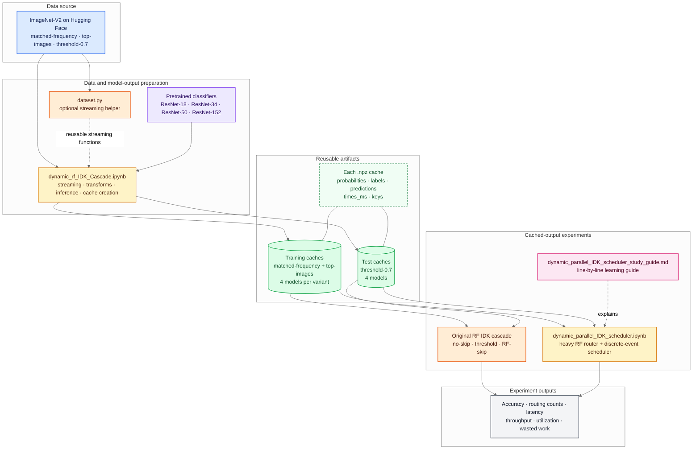
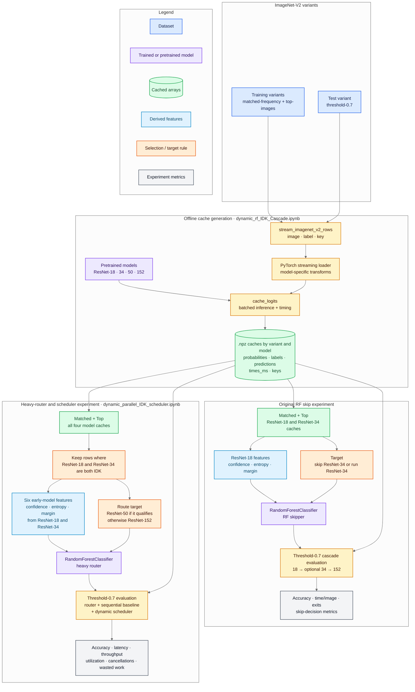
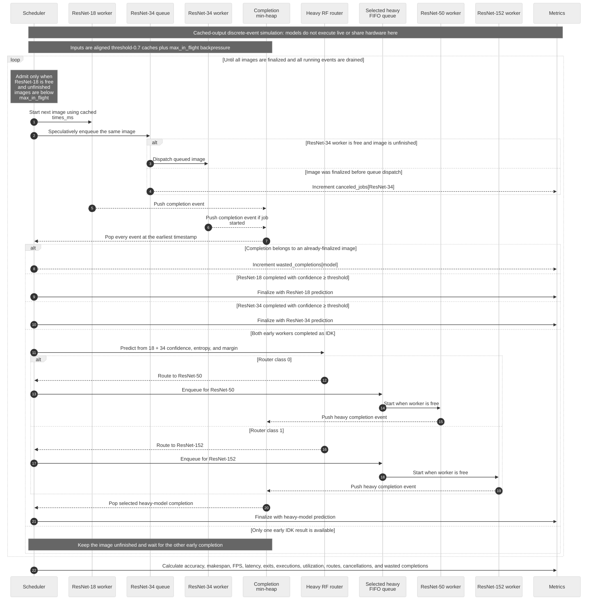

# Dynamic IDK Cascades Architecture

This document shows how the current project streams ImageNet-V2, creates
reusable model-output caches, trains Random Forest routing policies, and
simulates a parallel IDK scheduler.

The project has two main phases:

1. **Offline preparation:** stream images, run pretrained models, and save
   aligned `.npz` caches.
2. **Cached-output research:** train routing models and compare cascade or
   scheduling policies without repeating expensive neural-network inference.

## Visual legend

The diagrams use one consistent visual language:

| Color | Meaning |
| --- | --- |
| Blue | Dataset, feature, or scheduler-control input |
| Purple | Pretrained model, trained Random Forest, or model worker |
| Green | Reusable cache or worker queue |
| Orange | Processing logic, threshold decision, or routing rule |
| Gray | Final prediction or reported metric |
| Red | Canceled or wasted work |

## 1. Project overview

### How to read it

- `dynamic_rf_IDK_Cascade.ipynb` is the data preparation and original cascade
  notebook. It streams data, loads pretrained models, creates caches, trains
  the RF skipper, and evaluates skip strategies.
- `dynamic_parallel_IDK_scheduler.ipynb` consumes the caches. It trains a
  second Random Forest for choosing a heavy model and runs scheduling
  simulations.
- `dataset.py` provides the streaming portion as a small reusable Python
  helper; the research notebook also contains its own streaming functions.
- Once caches exist, routing and scheduler experiments do not need raw images
  or live neural-network inference.

## 2. Offline cache and training pipeline

### Cache contract

Every model cache must contain aligned arrays:

| Field | Meaning |
| --- | --- |
| `probabilities` | Shape `[num_images, 1000]`; model probability distribution |
| `labels` | Ground-truth ImageNet class for every image |
| `predictions` | Model top-1 class for every image |
| `times_ms` | Cached inference time per image in milliseconds |
| `keys` | Image identifiers used to verify ordering across model caches |

The cache validator in the scheduler notebook requires all four model caches to
contain the same sample count, labels, and keys.

### Training and test split

- **Router training:** matched-frequency plus top-images.
- **Reported test experiments:** threshold-0.7.
- **Original RF skipper:** learns whether ResNet-34 should run after
  ResNet-18 says IDK.
- **Heavy RF router:** learns whether a double-IDK image should go to
  ResNet-50 or ResNet-152.

## 3. Dynamic worker-reuse scheduler

### Scheduler behavior

1. Admission starts ResNet-18 and immediately queues the same image for
   ResNet-34. This speculative overlap can improve throughput.
2. Every model has one independent simulated worker. Completion events are
   ordered by finish time in a min-heap.
3. A confident ResNet-18 or ResNet-34 result finalizes the image.
4. If both early models return IDK, the heavy router selects ResNet-50 or
   ResNet-152 from six early-model features.
5. `max_in_flight` limits admitted but unfinished images. A small value applies
   backpressure and reduces queueing latency.
6. Work still waiting in a queue can be canceled after another model finalizes
   the image. Work already running cannot be interrupted and is counted as a
   wasted completion.

> **Important:** this scheduler is a deterministic cached-output
> discrete-event simulation. It models independent workers using stored
> per-image inference times; it does not execute four neural networks
> concurrently on hardware. Queueing logic is modeled, while model contention,
> data transfer, router inference time, and orchestration overhead are not.

## 4. Reading the reported metrics

- **Accuracy:** fraction of final predictions equal to ground-truth labels.
- **Makespan:** simulated time from the first admission to the last processed
  completion event.
- **Throughput:** images divided by makespan in seconds.
- **Latency:** time from one image's admission until its final prediction.
- **Utilization:** one worker's total busy time divided by makespan.
- **Canceled job:** queued speculative work removed before it starts.
- **Wasted completion:** work that had already started and completed after the
  image was finalized elsewhere.

Higher `max_in_flight` values can keep the ResNet-152 bottleneck busy and
maximize throughput, but they also allow a longer queue to form. That is why
the unlimited run can have similar throughput and dramatically worse latency
than a bounded run.

## Diagram sources

The editable Mermaid sources are:

- [`project-overview.mmd`](docs/architecture/project-overview.mmd)
- [`offline-training-pipeline.mmd`](docs/architecture/offline-training-pipeline.mmd)
- [`dynamic-scheduler.mmd`](docs/architecture/dynamic-scheduler.mmd)

The SVG files are generated from those sources and can be used in documents or
presentations that do not render Mermaid directly.
